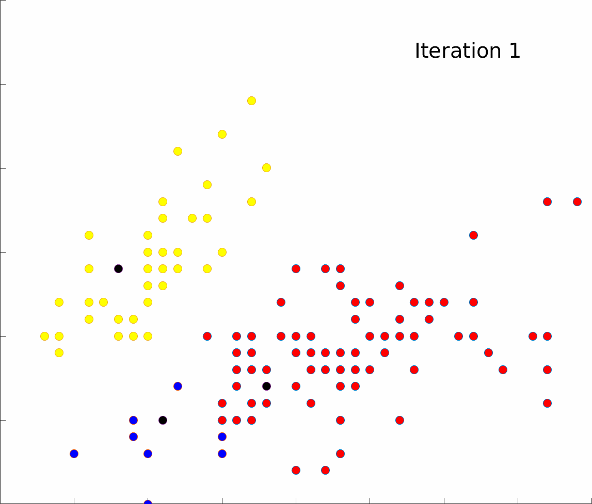
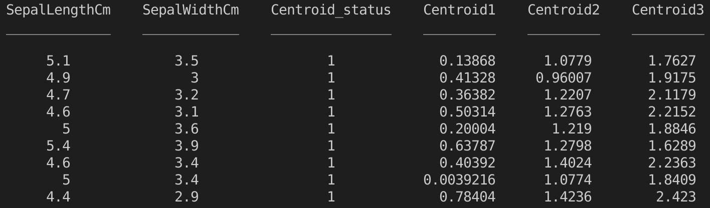
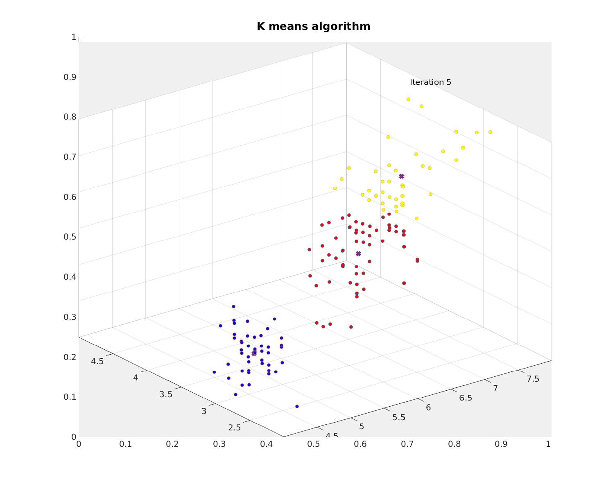

# Matlab K means for N dimensions

###

<p>


</p>


### K means principle
https://en.wikipedia.org/wiki/K-means_clustering

### How to use

-load data:
```Matlab
data = get_data('Iris.csv', 'path', [2,3]); %2nd and 3rd column of Iris dataset 
```
-initialize Kmeans class, choose desired number of clusters and iterations:
```Matlab
k_means = Kmeans(data, 3, 5); %data, number of clusters, number of iterations
```
-call train function,which will try to train the clustering N times
```Matlab
[res, inertia] = k_means.train(N, false); %N .. number of iterations for choosing the best clustering, true/false generate animation
```
-animation can be generated only for 2D and 3D input data

This functions return vector called res, which is 1D vector with assigned classes for every point and final intertia.

### Class structure 
K means class has only 3 user defined properties: data, number of clusters and number of iterations. Several other helpful properties such as dimensions, rows and actual centroids are hidden.

The data are held in the matlab table structure. I chose this rather than matrix because I liked the option of indexing by names, e.g 'Centroid_status' and not having to keep track of all the different indexes.



In this case first two columns represent user defined data points. Centroid_status columns tells to which centroid is every point assigned and columns Centroid1, Centroid2 and Centroid3 keep track of the distances between points and centroids.

This table is updated with every iteration.

### Algorithm 
Whole code is separated into micro functions which are called in a sequence.


1. Choosing first centroids
-randomly pick all of the starting centroids

2. Count distances
-count distance of every point from all of the centroids

3. Assign to clusters
-assign each point to its nearest centroid

4. Update centroids
-count new centroids by counting mean across all dimensions

5. Check stop condition 
-check whether centroids changed during last iteration

4. Count inertia


Example of 3D output picture for 5th iteration and 3 dimensions:



